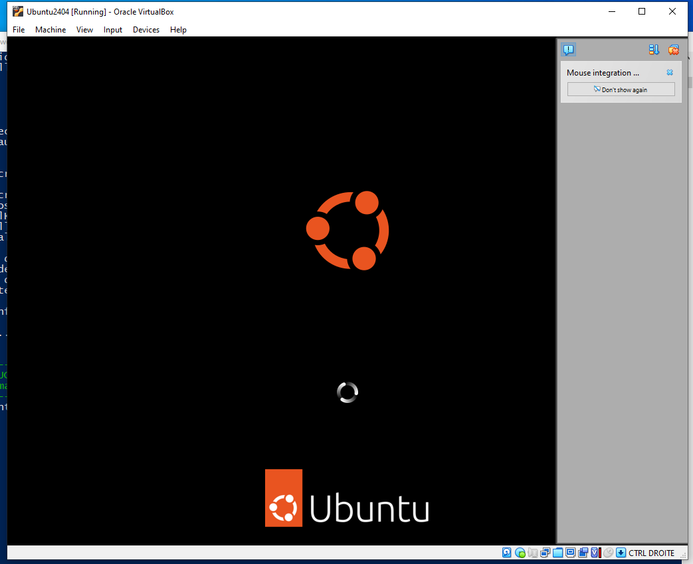
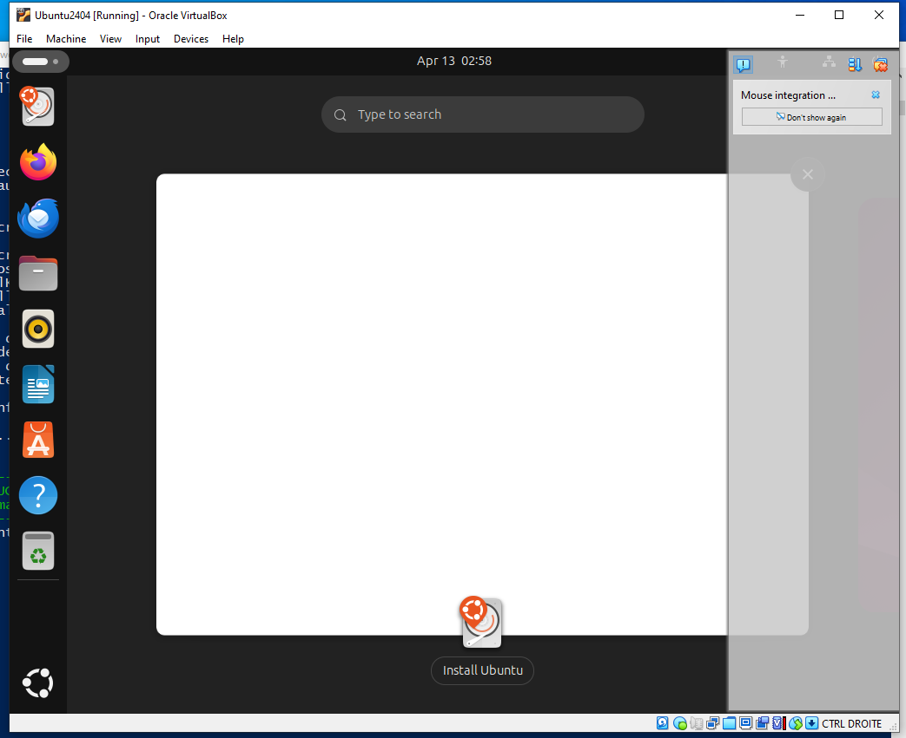
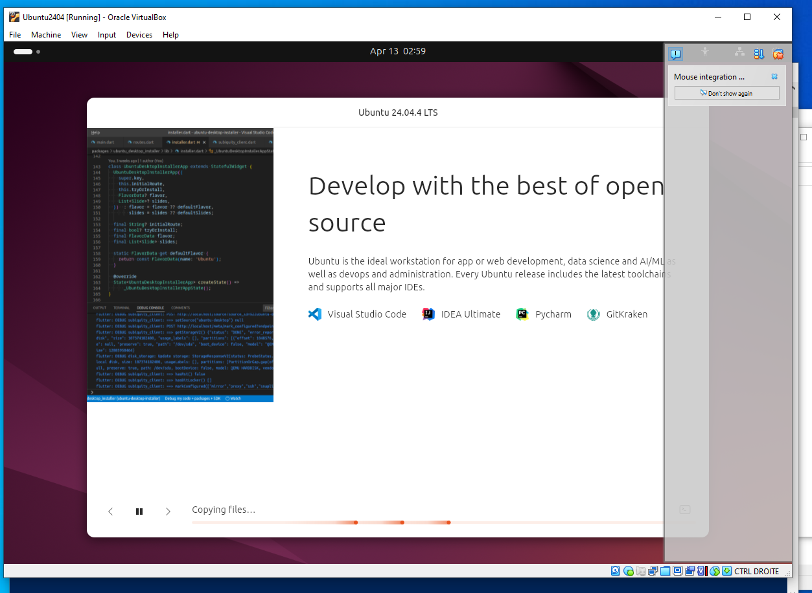

# 🐧 Installe Ubuntu sur ton ordi (Facile & Rapide)

Bienvenue ! Ce guide va t'aider à installer **Ubuntu** (un système Linux) à l'intérieur de ton Windows 11. Grâce au script automatisé, tu n'auras presque rien à faire.

## 🛠️ Ce que le script prépare pour toi :
*   Installation de **VirtualBox** (le moteur de la machine).
*   Téléchargement sécurisé d'**Ubuntu 24.04 LTS**.
*   Création d'un **Dossier Partagé** sur ton bureau pour échanger des fichiers facilement.
*   Configuration des mises à jour automatiques pour ta tranquillité.

---

## 🚀 Guide d'installation

### 1. Télécharger le script
Récupère le fichier d'installation ici :
👉 **[Télécharger Installer-Ubuntu-Final.ps1](Installer-Ubuntu-Final.ps1)**
*(Fais un clic droit sur le lien et choisis "Enregistrer le lien sous")*

### 2. Lancer l'installation
1.  Ouvre ton dossier **Téléchargements**.
2.  Appuie sur la touche **Shift (Majuscule)** de ton clavier et fais un **clic droit** dans le vide du dossier.
3.  Choisis **"Ouvrir dans le Terminal"** ou **"Ouvrir PowerShell ici"**.
4.  Copie et colle cette ligne, puis appuie sur **Entrée** :
    `powershell -ExecutionPolicy Bypass -File .\Installer-Ubuntu-Final.ps1`
5.  Si une fenêtre Windows te demande la permission, réponds **Oui**.

### 3. Premier démarrage et progression
Une fois que le script a terminé ses 7 étapes, tu verras une icône **"Demarrer Ubuntu2404"** sur ton bureau Windows. Double-clique dessus. 

**Patience :** L'installation se fait toute seule en arrière-plan. Voici les trois étapes que tu vas voir passer (ne touche à rien) :

#### Étape A : Le chargement initial
Le système prépare le terrain. Si tu vois le logo Ubuntu, c'est que ça fonctionne !

#### Étape B : Configuration automatique
La fenêtre peut devenir blanche ou afficher des menus rapidement, c'est normal.

#### Étape C : Installation des fichiers
Ubuntu finit d'installer ses composants. C'est l'étape la plus longue (10-15 min).

**Note :** Une fois terminé, la machine va redémarrer et tu arriveras sur ton bureau Ubuntu !

### ⚠️ Note importante sur la fin de l'installation
À la toute fin, il est possible qu'Ubuntu affiche un message d'erreur disant **"Something went wrong"** avec un triangle orange. 

**Pas de panique !** C'est un petit bogue visuel sans conséquence. Ton Ubuntu est en réalité déjà installé et prêt.
1. Clique sur le bouton **Close** ou ferme simplement la fenêtre de la machine.
2. Relance la machine avec l'icône sur ton bureau.
3. Quand on te demande ton mot de passe, tape : **user**

---

## 📁 Partager des fichiers
Le script a créé un dossier **Bureau_Ubuntu2404** sur ton bureau Windows.
*   Tout ce que tu mets dedans sera visible dans Ubuntu (dans le dossier `sf_Bureau_Partage`).
*   C'est la façon la plus simple de transférer tes documents entre les deux systèmes.

---

## 🌍 Mettre Ubuntu en français (après l'installation)

Il est possible qu'Ubuntu démarre en anglais la première fois. Pas de panique ! Voici comment le mettre en français en 1 minute :

1.  Clique sur la **petite flèche** en haut à droite de l'écran (près de l'horloge) et clique sur l'icône de l'engrenage (**Settings**).
2.  Dans la colonne de gauche, descends jusqu'à **System** puis clique sur **Region & Language**.
3.  Clique sur **Manage Installed Languages**.
    *   Si une fenêtre apparaît disant "The language support is not installed completely", clique sur **Install**.
4.  Clique sur **Install / Remove Languages...**, coche **French**, et clique sur **Apply**.
5.  Une fois chargé, glisse **Français** tout en haut de la liste.
6.  Clique sur le bouton **Apply System-Wide**.
7.  **Redémarre la machine virtuelle** et le tour est joué ! Ton Ubuntu sera entièrement en français du Québec.

---

## 🆘 Dépannage (BIOS)
Si le script affiche un message d'erreur concernant la **Virtualisation**, suis ces étapes (pour ordi **ASUS**) :

1.  Accepte l'option du script pour redémarrer vers le **BIOS**.
2.  Appuie sur **F7** pour le **Mode Avance / Advanced Mode**.
3.  Va dans l'onglet **Avance / Advanced** -> **Configuration du CPU / CPU Configuration**.
4.  Cherche **SVM Mode** et règle-le sur **Active / Enabled**.
5.  Appuie sur **F10** pour sauvegarder et quitter.
6.  Relance le script une fois revenu dans Windows.

---

